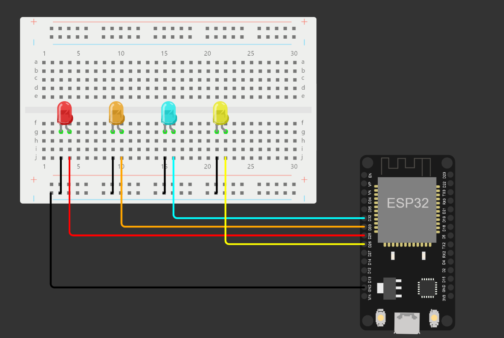

# Task1_IoT
## **Description**

In this task, the light will be turned on according to the last word read in the HTML browser. Whereas (forward) turns on the red light, (backward) turns on the yellow light, (left) turns on the orange light, (right) turns on the blue light, and finally (stop) turns off all the lights.

## **Circuit**

In these circuit we use these components:
1. 1 ESP32
1. 1 Breadboard 
1. 4 LED
1. Normal wires

